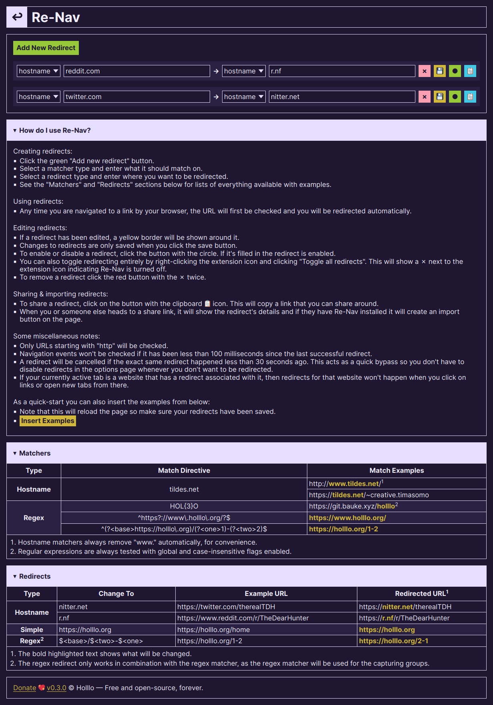

# Re ↩ Nav

> **Navigation redirects for the masses.**

## Installation

You can install Re-Nav through the stores linked above, [manually from a file] (see [the Releases page] for ZIP files) or [from source](#development).

[manually from a file]: https://support.mozilla.org/en-US/kb/find-and-install-add-ons-add-features-to-firefox#w_how-do-i-find-and-install-add-ons
[the Releases page]: https://git.bauke.xyz/Holllo/re-nav/releases

## Development

To build Re-Nav you will need [git](https://git-scm.com), [NodeJS](https://nodejs.org) and [pnpm](https://pnpm.io).

* Install the dependencies with `pnpm install`.
* Start a separate browser with `pnpm start`.
* Build the WebExtension for production with `pnpm build`.
* Test the code with `pnpm test`.

## License

Distributed under the [AGPL-3.0-or-later](https://spdx.org/licenses/AGPL-3.0-or-later.html) license, see [LICENSE](https://git.bauke.xyz/Holllo/re-nav/src/branch/main/LICENSE) for more information.
